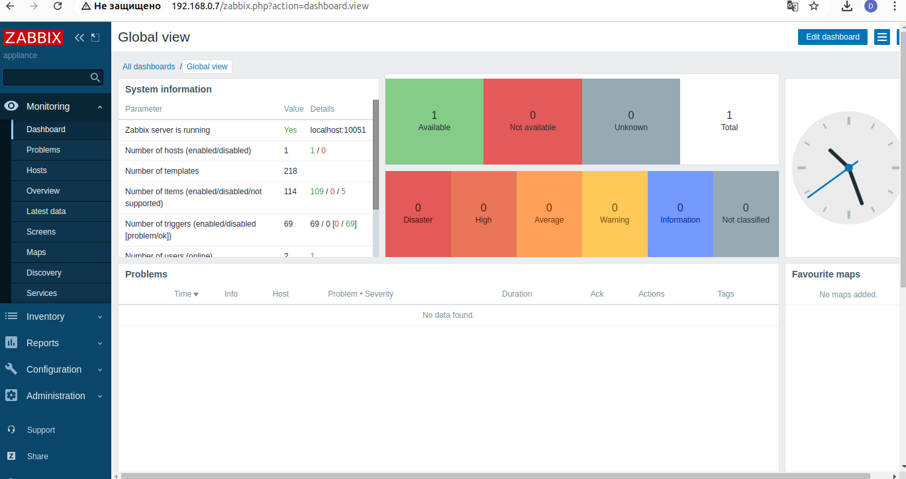
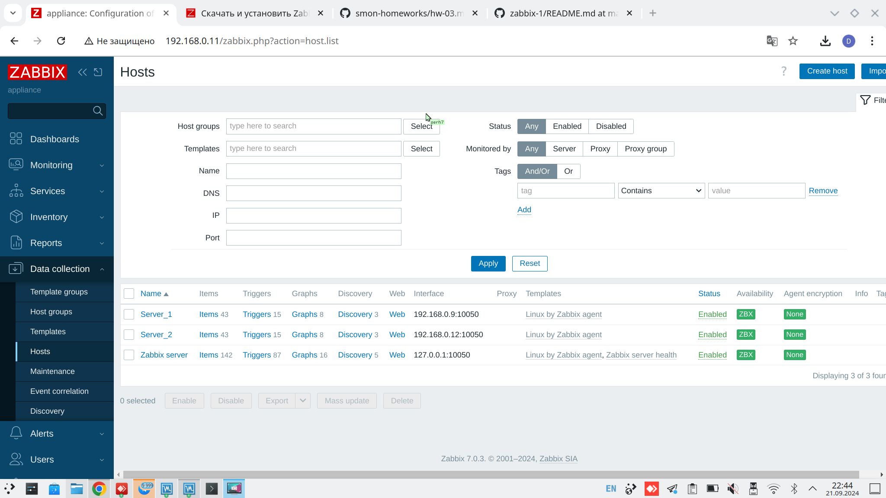
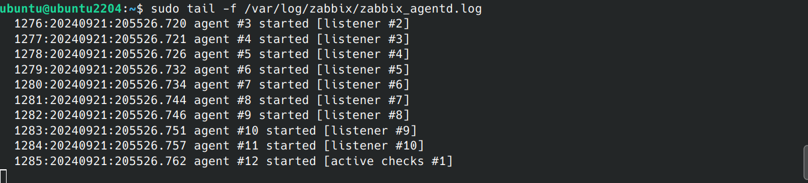
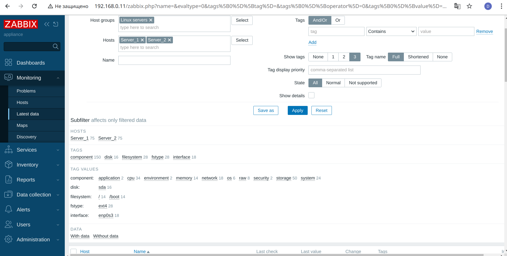

# Домашнее задание к занятию «Система мониторинга Zabbix» - Дмитрий Демченко

### Задание 1 

Установите Zabbix Server с веб-интерфейсом.

#### Процесс выполнения
1. Выполняя ДЗ, сверяйтесь с процессом отражённым в записи лекции.
2. Установите PostgreSQL. Для установки достаточна та версия, что есть в системном репозитороии Debian 11.
3. Пользуясь конфигуратором команд с официального сайта, составьте набор команд для установки последней версии Zabbix с поддержкой PostgreSQL и Apache.
4. Выполните все необходимые команды для установки Zabbix Server и Zabbix Web Server.

#### Требования к результаты 
1. Прикрепите в файл README.md скриншот авторизации в админке
   

3. Приложите в файл README.md текст использованных команд в GitHub.

   ### Установите репозиторий Zabbix

##### wget https://repo.zabbix.com/zabbix/5.0/debian/pool/main/z/zabbix-release/zabbix-release_5.0-2+debian11_all.deb
##### dpkg -i zabbix-release_5.0-2+debian11_all.deb
##### apt update

###  1. Установите Zabbix сервер, веб-интерфейс и агент

##### apt install zabbix-server-pgsql zabbix-frontend-php php7.4-pgsql zabbix-apache-conf zabbix-agent

### 2. Создайте базу данных

##### sudo -u postgres createuser --pwprompt zabbix
##### sudo -u postgres createdb -O zabbix zabbix
##### zcat /usr/share/doc/zabbix-server-pgsql*/create.sql.gz | sudo -u zabbix psql zabbix

### 3. Запустите процессы Zabbix сервера и агента

##### systemctl restart zabbix-server zabbix-agent apache2
##### systemctl enable zabbix-server zabbix-agent apache2

---

### Задание 2 

Установите Zabbix Agent на два хоста.

#### Процесс выполнения
1. Выполняя ДЗ, сверяйтесь с процессом отражённым в записи лекции.
2. Установите Zabbix Agent на 2 вирт.машины, одной из них может быть ваш Zabbix Server.
3. Добавьте Zabbix Server в список разрешенных серверов ваших Zabbix Agentов.
4. Добавьте Zabbix Agentов в раздел Configuration > Hosts вашего Zabbix Servera.
5. Проверьте, что в разделе Latest Data начали появляться данные с добавленных агентов.

#### Требования к результаты 
1. Приложите в файл README.md скриншот раздела Configuration > Hosts, где видно, что агенты подключены к серверу

2. Приложите в файл README.md скриншот лога zabbix agent, где видно, что он работает с сервером

3. Приложите в файл README.md скриншот раздела Monitoring > Latest data для обоих хостов, где видны поступающие от агентов данные.

4. Приложите в файл README.md текст использованных команд в GitHub

   ### 1. Установите репозиторий Zabbix
   
   ##### wget https://repo.zabbix.com/zabbix/7.0/ubuntu/pool/main/z/zabbix-release/zabbix-release_7.0-2+ubuntu24.04_all.deb
   ##### dpkg -i zabbix-release_7.0-2+ubuntu24.04_all.deb
   ##### apt update

   ### 2. Установите Zabbix агент

   ##### apt install zabbix-agent

   ### 3. Запустите процесс Zabbix агента

   ##### systemctl restart zabbix-agent
   ##### systemctl enable zabbix-agent

   ### 4. Редактирование файла /etc/zabbix/с
   ##### Добавление адреса Zabbix  сервера в директиву Server=192.168.*.*, файла /etc/zabbix/zabbix_agentd.conf Zabbix агента.

   ### 5. Перезагрузка zabbix agent
    ##### systemctl restart zabbix-agent

